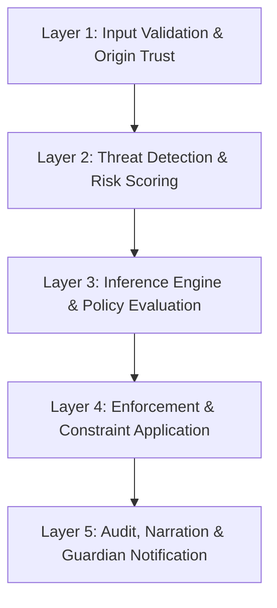
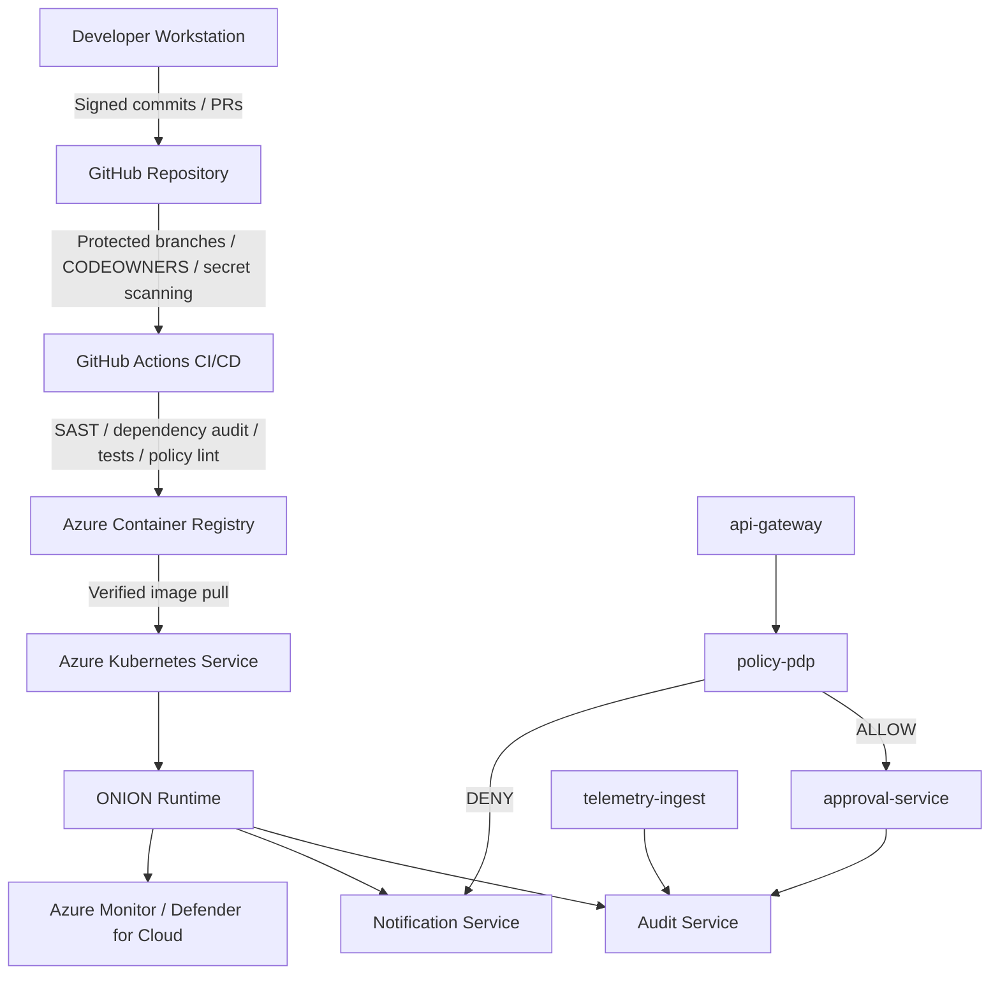
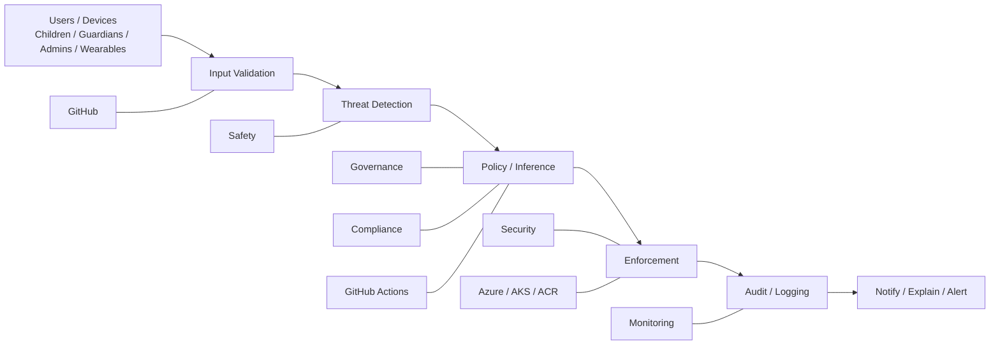

# 🧅 O.N.I.O.N (Observe, Notice, Infer, Operate, Narrate)
**Verified, Responsible, Safety-First AI System for Child Protection**

[](https://docs.github.com/en/repositories/creating-and-managing-repositories/best-practices-for-repositories)
[](https://learn.microsoft.com/en-us/azure/machine-learning/concept-responsible-ai?view=azureml-api-2)
[](https://cheatsheetseries.owasp.org/cheatsheets/CI_CD_Security_Cheat_Sheet.html)

> O.N.I.O.N is a zero-trust, policy-driven AI architecture designed for child safety, explainability, accountability, and end-to-end verification.

---

## 🎯 Mission

Build systems that **never operate without verification** and **never make decisions without responsibility**.

O.N.I.O.N is designed so that:
- Every action is **validated** before execution
- Every decision is **explainable** and **traceable**
- Every outcome is **accountable** to a responsible owner
- Every system is **safe, secure, and compliant**

---

## 🛡️ Responsible AI Commitment

O.N.I.O.N aligns with the **six Responsible AI principles**:

| Principle | Description |
|---|---|
| ⚖️ **Fairness** | AI systems treat all people fairly and avoid bias |
| 🛡️ **Reliability & Safety** | AI systems perform reliably and safely under all conditions |
| 🔒 **Privacy & Security** | AI systems respect privacy and maintain security |
| 🌍 **Inclusiveness** | AI systems empower everyone and engage all people |
| 🔍 **Transparency** | AI systems are understandable and explainable |
| ✅ **Accountability** | People remain accountable for AI systems and their outcomes |

**Core principle:**
> Verified systems + Responsible AI at every layer = trustworthy execution.

---

## 🧅 What O.N.I.O.N Means

The acronym describes how the system works in terms understandable to both technical teams and children:

| Letter | AI Term | Kid Term | What It Does |
|---|---|---|---|
| **O** | Observe / Origin | 👀 Look | Collect safe inputs from the environment |
| **N** | Notice / Navigate | 🔎 Notice | Detect patterns and risk signals |
| **I** | Infer / Imagine | 🤔 Think | Reason and choose safe options |
| **O** | Operate / Organize | ✅ Do | Apply policy and enforce constraints |
| **N** | Narrate / Notify | 📢 Tell | Explain decisions and alert guardians |

**Kid version:** Look → Notice → Think → Do → Tell.

---

## 🧠 Core Architecture

O.N.I.O.N uses a layered defense-in-depth model so that no single control is trusted by itself.

### Layered Model



### Core Services

| Service | Role | Description |
|---|---|---|
| `api-gateway` | Policy Enforcement Point (PEP) | Entry point; validates every request |
| `policy-pdp` | Policy Decision Point (PDP) | Evaluates policy rules; approves or denies actions |
| `approval-service` | Guardian Approvals | Handles overrides and parent consent flows |
| `telemetry-ingest` | Device Telemetry Intake | Ingests wearable and device data streams |
| `notification-service` | Alerts & Communications | Sends real-time alerts to guardians |
| `audit-service` | Immutable Audit Trail | Stores tamper-resistant evidence of every decision |

---

## 🔁 Full System Flow

The flow below shows the end-to-end path from source control to production runtime and monitoring.



### Blueprint Overview



---

## 📐 ASCII Blueprints

### Runtime Blueprint

```text
┌───────────────────────────────────────────────────────────────┐
│                         ONION Runtime                        │
├───────────────────────────────────────────────────────────────┤
│  [api-gateway] ──► [policy-pdp] ──► [approval-service]      │
│       │                 │                                    │
│       │                 ├── DENY ──► [notification-service] │
│       │                 └── ALLOW ─► [audit-service]        │
│       ▼                                                      │
│  [telemetry-ingest] ───────────────────► [audit-service]    │
└───────────────────────────────────────────────────────────────┘
```

### Platform Blueprint

```text
┌──────────────────────────────────────────────────────────────────────────┐
│                              Platform Blueprint                         │
├──────────────────────────────────────────────────────────────────────────┤
│ GitHub Repo -> GitHub Actions -> Azure Container Registry -> AKS        │
│      │                │                         │                 │       │
│      │                │                         │                 └─► Monitor
│      │                │                         └─► Signed Artifacts      │
│      └─► Reviews / Branch Protection / Security Scans                    │
└──────────────────────────────────────────────────────────────────────────┘
```

---

## ✅ Verification at Every Layer

| Layer | What Is Verified | How |
|---|---|---|
| **Source Code** | No secrets committed | GitHub secret scanning + pre-commit hooks |
| **Dependencies** | No known CVEs | Dependabot + `npm audit` / `pip audit` |
| **Build** | Code quality and security | CodeQL SAST, lint, unit tests |
| **Artifact** | Image integrity | cosign signature + SLSA provenance attestation |
| **Registry** | Image not tampered | ACR content trust + quarantine policy |
| **Deployment** | Config matches policy | OPA Gatekeeper + Conftest |
| **Runtime** | Requests are authorized | PEP → PDP policy evaluation |
| **Data** | Inputs are safe | Input validation + schema enforcement |
| **Decisions** | Decisions are explainable | Audit log entry per decision |
| **Alerts** | Guardians are notified | Notification service + escalation rules |

---

## 🔒 Compliance, Safety & Security Guidelines

### Security Principles
- **No long-lived credentials** — use OIDC and workload identity wherever possible
- **Least privilege** — every service account gets only required permissions
- **Immutable artifacts** — build once, sign once, deploy verified artifacts
- **Dependency pinning** — lock dependencies and monitor drift
- **Audit everything** — log every pipeline run, deployment, and runtime decision

### Safety Rules
- **No autonomous action without policy approval** — `policy-pdp` must return `ALLOW`
- **No silent failures** — all errors surface to `notification-service`
- **Guardian override always available** — `approval-service` enables human review
- **Data minimization** — collect only what is necessary and purge on schedule

### Privacy
- Telemetry is anonymized at ingestion before storage
- PII is encrypted at rest and in transit
- Data retention policies are enforced automatically

### Regulatory Alignment
- GDPR / COPPA — child data protection by design
- ISO 27001 — information security controls
- NIST AI RMF — AI risk management alignment
- OWASP ASVS Level 2 — application security verification

---

## 🚀 Getting Started

```bash
# Clone the repository
git clone https://github.com/Big-Orga/O.N.I.O.N.git
cd O.N.I.O.N

# Review the architecture docs
cat README.md

# Start local development when available
# docker compose up
```

---

## 🤝 Contributing

Please read [CONTRIBUTING.md](CONTRIBUTING.md) before submitting pull requests.
All contributors must follow the [Code of Conduct](CODE_OF_CONDUCT.md).

---

## 📜 License

See [LICENSE](LICENSE) for details.

---

## 🔗 References

- [GitHub Best Practices for Repositories](https://docs.github.com/en/repositories/creating-and-managing-repositories/best-practices-for-repositories)
- [Microsoft Responsible AI Principles](https://learn.microsoft.com/en-us/azure/machine-learning/concept-responsible-ai?view=azureml-api-2)
- [Azure Security and Responsible AI Guide](https://azure.github.io/Security-and-Responsible-AI-Guide/chapters/chapter_01_understanding_security_and_responsible_ai)
- [OWASP CI/CD Security Cheat Sheet](https://cheatsheetseries.owasp.org/cheatsheets/CI_CD_Security_Cheat_Sheet.html)
- [NIST AI Risk Management Framework](https://www.nist.gov/system/files/documents/2023/01/26/AI%20RMF%201.0.pdf)
- [SLSA Supply Chain Levels for Software Artifacts](https://slsa.dev/)
