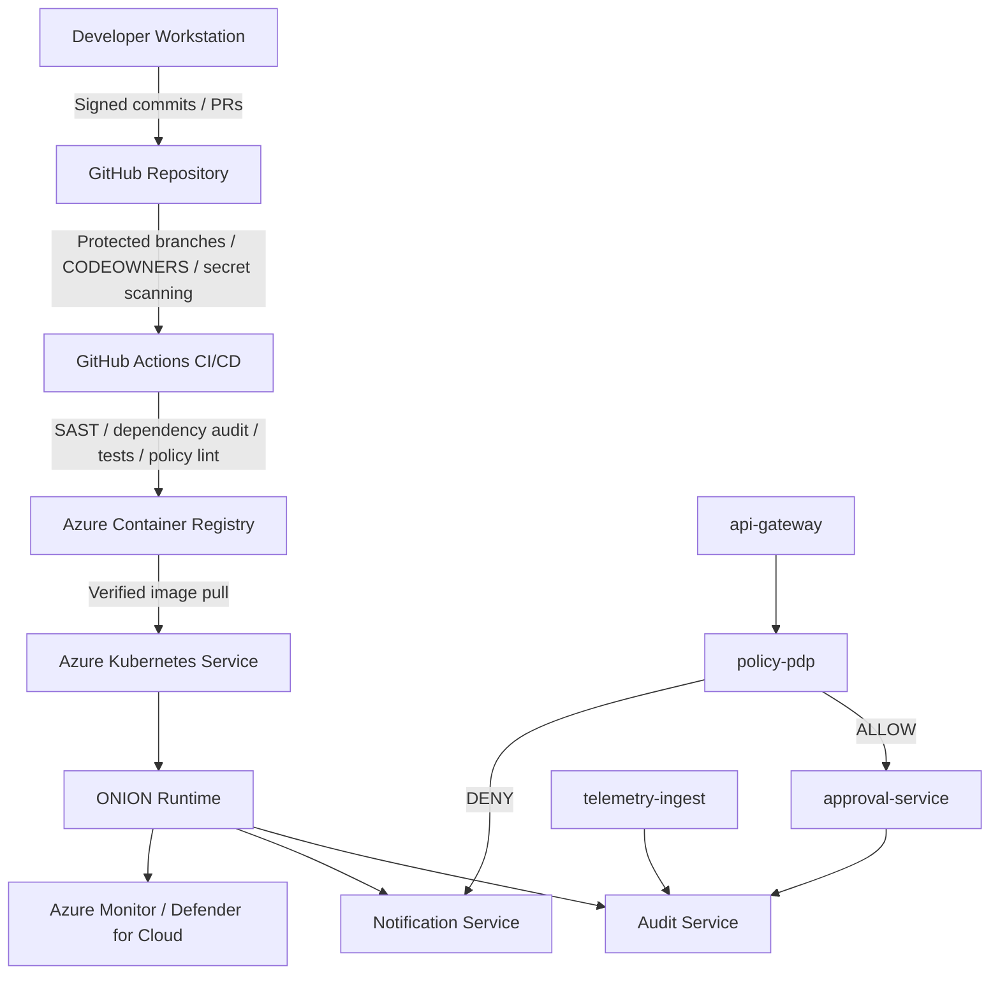
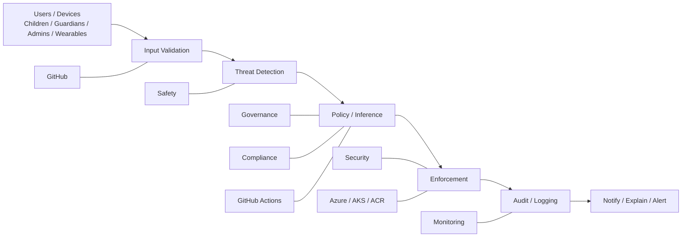

## ⚙️ Environment Variables

Before running O.N.I.O.N locally or in CI/CD, create a `.env` file at `AZ123ONI/.env` with the following structure:

```env
# Azure configuration for AI services
AZURE_EXISTING_AGENT_ID=...
AZURE_ENV_NAME=...
AZURE_LOCATION=...
AZURE_SUBSCRIPTION_ID=...
AZURE_EXISTING_AIPROJECT_ENDPOINT=...
AZURE_EXISTING_AIPROJECT_RESOURCE_ID=...
AZURE_EXISTING_RESOURCE_ID=...
AZD_ALLOW_NON_EMPTY_FOLDER=...
```

- NEVER commit secrets or production credentials.
- Use sample or dummy values in any example `.env` you share.

> See [`AZ123ONI/.env`](AZ123ONI/.env) for the template or required settings.

# 🧅 O.N.I.O.N — Observe, Notice, Infer, Operate, Narrate

**Verified • Responsible • Safety-First AI System (Child-Centered)**

[](https://docs.github.com/en/repositories/creating-and-managing-repositories/best-practices-for-repositories)
[](https://learn.microsoft.com/en-us/azure/machine-learning/concept-responsible-ai?view=azureml-api-2)
[](https://cheatsheetseries.owasp.org/cheatsheets/CI_CD_Security_Cheat_Sheet.html)

> O.N.I.O.N is a zero-trust, policy-driven AI architecture designed to help protect children through verification-first workflows, explainable decisions, parent-aware controls, and accountable systems.

---

## 🎯 Mission

- **Never act without verification**
- **Never decide without accountability**
- **Always explain all decisions**
- **Always prioritize safety (especially for children)**

---

## 📦 Quickstart

```bash
git clone https://github.com/MoneyMan421/O.N.I.O.N.git
cd O.N.I.O.N
cat README.md
```

---

## 🧅 ONION Acronym

| Letter | AI Meaning                     | Kid-Friendly |
|--------|--------------------------------|--------------|
| O      | Observe / Origin (input data)  | Look         |
| N      | Notice / Navigate (signals)    | Notice       |
| I      | Infer / Imagine (decide)       | Think        |
| O      | Operate / Organize (execute)   | Do           |
| N      | Narrate / Notify (explain)     | Tell         |

*Flow: Observe → Notice → Infer → Operate → Narrate*

---

## 🧠 Responsible AI Commitment

| Principle            | Meaning               |
|----------------------|----------------------|
| Fairness             | Avoid bias           |
| Reliability & Safety | Behave safely        |
| Privacy & Security   | Protect user data    |
| Inclusiveness        | Accessible to all    |
| Transparency         | Explainable choices  |
| Accountability       | Human oversight      |

See [Microsoft Responsible AI](https://www.microsoft.com/en-us/ai/responsible-ai)

---

## 🏗 Architecture: Layered Defense

```text
🧅 L1: INPUT    (Observe)
🧅 L2: SIGNAL   (Notice)
🧅 L3: DECISION (Infer → PDP)
🧅 L4: CONTROL  (Operate → PEP)
🧅 L5: OUTPUT   (Narrate/Audit)
```

**Core Services**:  
api-gateway (PEP enforcement), policy-pdp (PDP decision), approval-service (human approval), telemetry-ingest (input validation), notification-service (alerts), audit-service (trace & compliance)

---

## 🧅 O.N.I.O.N End-to-End Secure Policy Workflow (Full Detail)

```mermaid
flowchart TD
    A[GitHub Source\nCommit / PR / Merge] --> B[Observe / Entry / Trigger\nLook]
    B --> C[Notice / Build\nNotice]
    C --> D[Infer / Test\nThink]
    D --> E[Infer / Policy Decision\nThink]
    E --> F[Operate / Human Oversight\nDo]
    F --> G[Operate / Deploy / Enforcement\nDo]
    G --> H[Narrate / Runtime Verification\nTell]
    H --> I[Narrate / Audit / Traceability\nTell]
    I --> J[Narrate / Monitor / Feedback\nTell]

    R1[Responsibility + Accountability] --- A
    R2[Security + Integrity] --- B
    R3[Natural Ability + Reliability] --- C
    R4[Safety + Fairness] --- D
    R5[Explainability + Transparency] --- E
    R6[Human Oversight + Inclusiveness] --- F
    R7[Compliance + Privacy + Security] --- G
    R8[Reliability + Safety] --- H
    R9[Accountability + Transparency] --- I
    R10[Continuous Improvement] --- J

──────────────────────────────────────────────────────────────────────────────
Verified • Responsible • Safe • Secure • Explainable • Accountable • Compliant
Mission enforced everywhere: Responsibility • Accountability • Explainability
Natural Ability • Integrity • Safety • Compliance • Security • Constraints
Responsible AI embedded everywhere: Fairness • Reliability & Safety • Privacy & Security
Inclusiveness • Transparency • Accountability
──────────────────────────────────────────────────────────────────────────────
👤 Developer
   │
   ▼
┌───────────────────────────────────────────────────────────┐
│ GitHub Source (Commit / PR / Merge)                      │
└───────────────────────────────────────────────────────────┘
   │ ✅ VERIFY: code integrity + review trail
   │ 🧠 MISSION: accountability, integrity, constraints
   │ 🧠 RAI: transparency, accountability
   ▼
🧅 L1 — OBSERVE / ENTRY / TRIGGER
┌───────────────────────────────────────────────────────────┐
│ GitHub Actions Trigger                                   │
│ - workflow events (push / PR)                            │
│ - protected branches                                     │
└───────────────────────────────────────────────────────────┘
   │ ✅ VERIFY: trigger correctness + permissions
   │ 🧠 MISSION: responsibility, security
   │ 🧠 RAI: transparency, accountability
   ▼
🧅 L2 — NOTICE / BUILD
┌───────────────────────────────────────────────────────────┐
│ Build & Package                                          │
│ - install dependencies                                   │
│ - create trusted artifact                                │
└───────────────────────────────────────────────────────────┘
   │ ✅ VERIFY: reproducible artifact
   │ ✅ INTEGRITY: trusted build outputs
   │ 🧠 MISSION: integrity, natural ability, constraints
   │ 🧠 RAI: reliability & safety
   ▼
🧅 L3 — INFER / TEST
┌───────────────────────────────────────────────────────────┐
│ Test & Quality Gates                                     │
│ - unit / integration tests                               │
│ - lint / static checks                                   │
└───────────────────────────────────────────────────────────┘
   │ ✅ VERIFY: correctness + quality
   │ 🛡️ SAFETY: prevent unsafe regressions
   │ 🧠 MISSION: safety, responsibility, explainability
   │ 🧠 RAI: reliability & safety, fairness
   ▼
🧅 L4 — INFER / POLICY DECISION
┌───────────────────────────────────────────────────────────┐
│ Policy Decision Point (PDP)                              │
│ - security checks + compliance rules                     │
│ - returns decision + reasons + obligations               │
└───────────────────────────────────────────────────────────┘
   │ ✅ VERIFY: compliance + security gates
   │ ✅ EXPLAINABILITY: reason codes required
   │ 🧠 MISSION: accountability, explainability, compliance, constraints
   │ 🧠 RAI: fairness, transparency, accountability
   ▼
🧅 L5 — OPERATE / HUMAN OVERSIGHT
┌───────────────────────────────────────────────────────────┐
│ Approval Gate                                            │
│ - parent approval for sensitive actions                  │
│ - release approval for high-risk production changes      │
└───────────────────────────────────────────────────────────┘
   │ ✅ VERIFY: authorized oversight
   │ 🧠 MISSION: responsibility, accountability, safety
   │ 🧠 RAI: accountability, inclusiveness
   ▼
🧅 L6 — OPERATE / DEPLOY / ENFORCEMENT
┌───────────────────────────────────────────────────────────┐
│ Deploy to Azure / Runtime Enforcement                    │
│ - deploy revision                                        │
│ - enforce ingress and runtime policies                   │
└───────────────────────────────────────────────────────────┘
   │ ✅ VERIFY: correct environment + constraints
   │ 🔐 SECURITY: no bypass allowed
   │ 🧠 MISSION: security, compliance, integrity, constraints
   │ 🧠 RAI: privacy & security
   ▼
🧅 L7 — NARRATE / RUNTIME VERIFICATION
┌───────────────────────────────────────────────────────────┐
│ Runtime Checks                                           │
│ - health / readiness / liveness                          │
│ - smoke tests                                            │
└───────────────────────────────────────────────────────────┘
   │ ✅ VERIFY: safe operation + stability
   │ 🧠 MISSION: safety, responsibility
   │ 🧠 RAI: reliability & safety
   ▼
🧅 L8 — NARRATE / AUDIT / TRACEABILITY
┌───────────────────────────────────────────────────────────┐
│ Audit Evidence                                           │
│ - decision logs + correlation IDs                        │
│ - policy versions + reason codes                         │
└───────────────────────────────────────────────────────────┘
   │ ✅ VERIFY: accountability evidence
   │ 🧠 MISSION: explainability, accountability, integrity
   │ 🧠 RAI: transparency, accountability
   ▼
🧅 L9 — NARRATE / MONITOR / FEEDBACK LOOP
┌───────────────────────────────────────────────────────────┐
│ Monitoring / Observability                               │
│ - logs / metrics / alerts                                │
│ - anomaly detection                                      │
└───────────────────────────────────────────────────────────┘
   │ ✅ VERIFY: drift detection + continuous evaluation
   │ 🧠 MISSION: responsibility, safety, natural ability
   │ 🧠 RAI: reliability & safety, transparency
   ▼
🔁 Continuous loop: Commit → Verify → Decide → Approve → Deploy → Audit → Monitor → Improve

flowchart TD
    A[Observe / Origin\nLook\nSafe Inputs + Trusted Origin] --> B[Notice / Navigate\nNotice\nThreat Detection + Risk Signals]
    B --> C[Infer / Imagine\nThink\nReasoning + Policy Evaluation]
    C --> D[Operate / Organize\nDo\nEnforcement + Constraints]
    D --> E[Narrate / Notify\nTell\nAudit + Explanation + Guardian Notification]

    M1[Responsibility] --- A
    M2[Safety] --- B
    M3[Explainability] --- C
    M4[Security + Compliance + Constraints] --- D
    M5[Accountability + Transparency] --- E
```

---

## 🖼️ End-to-End Flow Diagram



---

## 🗺️ System Blueprint Diagram



---

## ✅ Security & Compliance Checklist

- [ ] Branch protection and code review required
- [ ] Dependabot and secret scanning enabled
- [ ] Code scanning (CodeQL) active
- [ ] No secrets in code
- [ ] OIDC for GitHub Actions
- [ ] Minimal permissions for CI workflows
- [ ] Container/image signing and provenance
- [ ] Audit trail for all sensitive actions

See [OWASP CI/CD Security](https://cheatsheetseries.owasp.org/cheatsheets/CI_CD_Security_Cheat_Sheet.html)  
Supports GDPR, COPPA, ISO 27001, NIST AI RMF, OWASP ASVS L2.

---

## 🤝 Contributing

All contributors must follow our [Code of Conduct](CODE_OF_CONDUCT.md).  
See [CONTRIBUTING.md](CONTRIBUTING.md) for guidelines.

---

## 📜 License

See [LICENSE](LICENSE) for details.

---

## References

- [GitHub Best Practices](https://docs.github.com/en/repositories/creating-and-managing-repositories/best-practices-for-repositories)
- [Microsoft Responsible AI Principles](https://www.microsoft.com/en-us/ai/responsible-ai)
- [OWASP CI/CD Security Cheat Sheet](https://cheatsheetseries.owasp.org/cheatsheets/CI_CD_Security_Cheat_Sheet.html)
