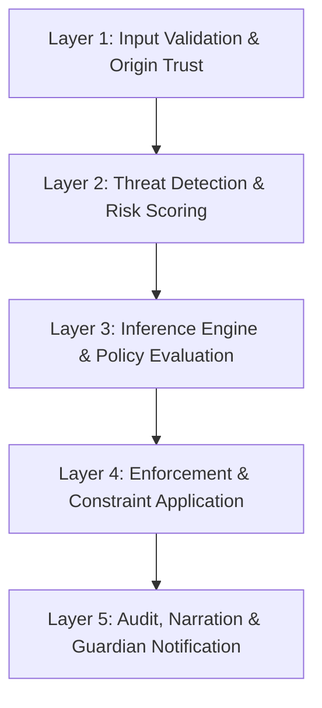

# 🧅 O.N.I.O.N (Observe, Notice, Infer, Operate, Narrate)
**Verified, Responsible, Safety-First AI System for Child Protection**

[](https://docs.github.com/en/repositories/creating-and-managing-repositories/best-practices-for-repositories)
[](https://learn.microsoft.com/en-us/azure/machine-learning/concept-responsible-ai?view=azureml-api-2)
[](https://cheatsheetseries.owasp.org/cheatsheets/CI_CD_Security_Cheat_Sheet.html)

> O.N.I.O.N is a zero-trust, policy-driven AI architecture designed for child safety, explainability, accountability, and end-to-end verification.

---

## 🎯 Mission + Responsible AI Commitment

O.N.I.O.N exists to build systems that **never operate without verification** and **never make decisions without responsibility**.

Our mission and responsible AI commitment are one and the same: to design AI systems that are safe, transparent, accountable, secure, and aligned to human oversight at every layer.

### Core Mission Standards

- **Responsibility** — Every output, recommendation, and action must be handled with care because real people, especially children, are affected by system behavior.
- **Accountability** — We do not guess when certainty matters. If information is incomplete, unclear, or uncertain, the system must ask for more information, defer, or deny safely.
- **Explainability** — Every meaningful action and decision must be understandable, traceable, and backed by clear reason codes, logic, and evidence.
- **Natural Ability** — Tools and capabilities must only be used where there is a natural fit for the task, never forcing unnecessary complexity or unjustified automation.
- **Integrity** — Systems must behave honestly, consistently, and within stated boundaries.
- **Safety** — Harm reduction, child protection, and secure defaults are mandatory.
- **Compliance** — Policies, standards, governance, and legal obligations must be respected by design.
- **Security** — Systems, identities, data, and execution paths must be protected with defense-in-depth controls.
- **Constraints** — Trustworthy AI operates within explicit limits, permissions, approvals, and intended use.

### Responsible AI Principles Embedded in the Mission

O.N.I.O.N aligns its mission directly with the six Responsible AI principles:

| Principle | How it is expressed in O.N.I.O.N |
|---|---|
| ⚖️ **Fairness** | Policy and verification reduce arbitrary or biased actions |
| 🛡️ **Reliability & Safety** | Systems are tested, monitored, and denied by default when uncertain |
| 🔒 **Privacy & Security** | Child data is minimized, protected, and handled securely |
| 🌍 **Inclusiveness** | Explanations and safeguards are designed for real families and human oversight |
| 🔍 **Transparency** | Decisions require reasons, traceability, and clear explanations |
| ✅ **Accountability** | Human responsibility remains attached to high-impact decisions |

**Core principle:**  
> Verified systems + Responsible AI at every layer = trustworthy execution.

---

## 🧅 What O.N.I.O.N Means

The acronym describes how the system works in terms understandable to both technical teams and children:

| Letter | AI Term | Kid Term | What It Does |
|---|---|---|---|
| **O** | Observe / Origin | 👀 Look | Collect safe inputs from the environment |
| **N** | Notice / Navigate | 🔎 Notice | Detect patterns and risk signals |
| **I** | Infer / Imagine | 🤔 Think | Reason and choose safe options |
| **O** | Operate / Organize | ✅ Do | Apply policy and enforce constraints |
| **N** | Narrate / Notify | 📢 Tell | Explain decisions and alert guardians |

**Kid version:** Look → Notice → Think → Do → Tell.

---

## 🧠 Core Architecture

O.N.I.O.N uses a layered defense-in-depth model so that no single control is trusted by itself.

### Layered Model



### Core Services

| Service | Role | Description |
|---|---|---|
| `api-gateway` | Policy Enforcement Point (PEP) | Entry point; validates every request |
| `policy-pdp` | Policy Decision Point (PDP) | Evaluates policy rules; approves or denies actions |
| `approval-service` | Guardian Approvals | Handles overrides and parent consent flows |
| `telemetry-ingest` | Device Telemetry Intake | Ingests wearable and device data streams |
| `notification-service` | Alerts & Communications | Sends real-time alerts to guardians |
| `audit-service` | Immutable Audit Trail | Stores tamper-resistant evidence of every decision |

---

## 🔁 Full System Flow

The flow below shows the end-to-end path from source control to production runtime and monitoring, with the mission statement and responsible AI standards embedded directly into the operating model.

```text
────────────────────────────────────────────────────────────────────────
Verified • Responsible • Safe • Secure • Explainable • Accountable • Compliant
Mission enforced everywhere: Responsibility • Accountability • Explainability
Natural Ability • Integrity • Safety • Compliance • Security • Constraints
Responsible AI embedded everywhere: Fairness • Reliability & Safety • Privacy & Security
Inclusiveness • Transparency • Accountability
────────────────────────────────────────────────────────────────────────
👤 Developer
   │
   ▼
┌───────────────────────────────────────────────────────────┐
│ GitHub Source (Commit / PR / Merge)                      │
└───────────────────────────────────────────────────────────┘
   │ ✅ VERIFY: code integrity + review trail
   │ 🧠 MISSION: accountability, integrity, constraints
   │ 🧠 RAI: accountability, transparency
   ▼
🧅 L1 — ENTRY / TRIGGER
┌───────────────────────────────────────────────────────────┐
│ GitHub Actions Trigger                                   │
│ - workflow events (push / PR)                            │
│ - protected branches                                     │
└───────────────────────────────────────────────────────────┘
   │ ✅ VERIFY: trigger correctness + permissions
   │ 🧠 MISSION: responsibility, security
   │ 🧠 RAI: transparency, accountability
   ▼
🧅 L2 — BUILD
┌───────────────────────────────────────────────────────────┐
│ Build & Package                                          │
│ - install dependencies                                   │
│ - build container image                                  │
└───────────────────────────────────────────────────────────┘
   │ ✅ VERIFY: reproducible artifact
   │ ✅ INTEGRITY: trusted build outputs
   │ 🧠 MISSION: integrity, natural ability, constraints
   │ 🧠 RAI: reliability & safety
   ▼
🧅 L3 — TEST
┌───────────────────────────────────────────────────────────┐
│ Test & Quality Gates                                     │
│ - unit / integration tests                               │
│ - lint / static checks                                   │
└───────────────────────────────────────────────────────────┘
   │ ✅ VERIFY: correctness + quality
   │ 🛡️ SAFETY: prevent unsafe regressions
   │ 🧠 MISSION: safety, responsibility, explainability
   │ 🧠 RAI: reliability & safety, fairness
   ▼
🧅 L4 — POLICY
┌───────────────────────────────────────────────────────────┐
│ Policy Decision Point (PDP)                              │
│ - security checks + compliance rules                     │
│ - produces decision + reasons + obligations              │
└───────────────────────────────────────────────────────────┘
   │ ✅ VERIFY: compliance + security gates
   │ ✅ EXPLAINABILITY: reason codes required
   │ 🧠 MISSION: accountability, explainability, compliance, constraints
   │ 🧠 RAI: fairness, transparency, accountability
   ▼
🧅 L5 — CONTROL / HUMAN OVERSIGHT
┌───────────────────────────────────────────────────────────┐
│ Approval Gate                                            │
│ - parent approval for sensitive actions                  │
│ - release approval for production if required            │
└───────────────────────────────────────────────────────────┘
   │ ✅ VERIFY: authorized oversight
   │ 🧠 MISSION: responsibility, accountability, safety
   │ 🧠 RAI: accountability, inclusiveness
   ▼
🧅 L6 — DEPLOY / ENFORCEMENT
┌───────────────────────────────────────────────────────────┐
│ Deploy to Azure / Runtime Enforcement                    │
│ - deploy revision                                        │
│ - enforce ingress and runtime policies                   │
└───────────────────────────────────────────────────────────┘
   │ ✅ VERIFY: correct environment + constraints
   │ 🔐 SECURITY: no bypass allowed
   │ 🧠 MISSION: security, compliance, integrity, constraints
   │ 🧠 RAI: privacy & security
   ▼
🧅 L7 — RUNTIME VERIFICATION
┌───────────────────────────────────────────────────────────┐
│ Runtime Checks                                           │
│ - health / readiness / liveness                          │
│ - smoke tests                                            │
└───────────────────────────────────────────────────────────┘
   │ ✅ VERIFY: safe operation + stability
   │ 🧠 MISSION: safety, responsibility
   │ 🧠 RAI: reliability & safety
   ▼
🧅 L8 — AUDIT / TRACEABILITY
┌───────────────────────────────────────────────────────────┐
│ Audit Evidence                                           │
│ - decision logs + correlation IDs                        │
│ - policy versions + reason codes                         │
└───────────────────────────────────────────────────────────┘
   │ ✅ VERIFY: accountability evidence
   │ 🧠 MISSION: explainability, accountability, integrity
   │ 🧠 RAI: transparency, accountability
   ▼
🧅 L9 — MONITOR / FEEDBACK LOOP
┌───────────────────────────────────────────────────────────┐
│ Monitoring / Observability                               │
│ - logs / metrics / alerts                                │
│ - anomaly detection                                      │
└───────────────────────────────────────────────────────────┘
   │ ✅ VERIFY: drift detection + continuous evaluation
   │ 🧠 MISSION: responsibility, safety, natural ability
   │ 🧠 RAI: reliability & safety, transparency
   ▼
🔁 Continuous loop: Commit → Verify → Decide → Approve → Deploy → Audit → Monitor → Improve
```

---

## ✅ Verification at Every Layer

| Layer | What Is Verified | How |
|---|---|---|
| **Source Code** | No secrets committed | GitHub secret scanning + pre-commit hooks |
| **Dependencies** | No known CVEs | Dependabot + `npm audit` / `pip audit` |
| **Build** | Code quality and security | CodeQL SAST, lint, unit tests |
| **Artifact** | Image integrity | cosign signature + SLSA provenance attestation |
| **Registry** | Image not tampered | ACR content trust + quarantine policy |
| **Deployment** | Config matches policy | OPA Gatekeeper + Conftest |
| **Runtime** | Requests are authorized | PEP → PDP policy evaluation |
| **Data** | Inputs are safe | Input validation + schema enforcement |
| **Decisions** | Decisions are explainable | Audit log entry per decision |
| **Alerts** | Guardians are notified | Notification service + escalation rules |

---

## 🛡 Child Safety Guidelines

### Safety Defaults
- Default deny on uncertain or unknown conditions
- Parent authority for sensitive actions
- Explainability required for all decisions
- No child-impacting high-risk action without verification and approval

### Prohibited Behavior
- No autonomous high-risk action without PDP and approval
- No silent decisions
- No fabricated explanations
- No leakage of sensitive child data

---

## 🔒 Compliance, Safety & Security Guidelines

### Security Principles
- **No long-lived credentials** — use OIDC and workload identity wherever possible
- **Least privilege** — every service account gets only required permissions
- **Immutable artifacts** — build once, sign once, deploy verified artifacts
- **Dependency pinning** — lock dependencies and monitor drift
- **Audit everything** — log every pipeline run, deployment, and runtime decision

### Safety Rules
- **No autonomous action without policy approval** — `policy-pdp` must return `ALLOW`
- **No silent failures** — all errors surface to `notification-service`
- **Guardian override always available** — `approval-service` enables human review
- **Data minimization** — collect only what is necessary and purge on schedule

### Privacy
- Telemetry is anonymized at ingestion before storage
- PII is encrypted at rest and in transit
- Data retention policies are enforced automatically

### Regulatory Alignment
- GDPR / COPPA — child data protection by design
- ISO 27001 — information security controls
- NIST AI RMF — AI risk management alignment
- OWASP ASVS Level 2 — application security verification

---

## 📦 Recommended Repository Structure

```text
onion-guardian-agent/
├── README.md
├── LICENSE
├── CODE_OF_CONDUCT.md
├── CONTRIBUTING.md
├── SECURITY.md
├── CHANGELOG.md
├── .gitignore
├── docker-compose.yml
├── .github/
├── services/
├── agents/
├── packages/
├── infrastructure/
├── ci-cd/
├── configs/
├── docs/
├── scripts/
├── tests/
└── resources/
```

---

## 🚀 Getting Started

```bash
# Clone the repository
git clone https://github.com/Big-Orga/O.N.I.O.N.git
cd O.N.I.O.N

# Review the architecture docs
cat README.md
```

---

## 🤝 Contributing

Please read [CONTRIBUTING.md](CONTRIBUTING.md) before submitting pull requests.  
All contributors must follow the [Code of Conduct](CODE_OF_CONDUCT.md).

---

## 📜 License

See [LICENSE](LICENSE) for details.

---

## 🔗 References

- [GitHub Best Practices for Repositories](https://docs.github.com/en/repositories/creating-and-managing-repositories/best-practices-for-repositories)
- [Microsoft Responsible AI Principles](https://learn.microsoft.com/en-us/azure/machine-learning/concept-responsible-ai?view=azureml-api-2)
- [Azure Security and Responsible AI Guide](https://azure.github.io/Security-and-Responsible-AI-Guide/chapters/chapter_01_understanding_security_and_responsible_ai)
- [OWASP CI/CD Security Cheat Sheet](https://cheatsheetseries.owasp.org/cheatsheets/CI_CD_Security_Cheat_Sheet.html)
- [NIST AI Risk Management Framework](https://www.nist.gov/system/files/documents/2023/01/26/AI%20RMF%201.0.pdf)
- [SLSA Supply Chain Levels for Software Artifacts](https://slsa.dev/)
