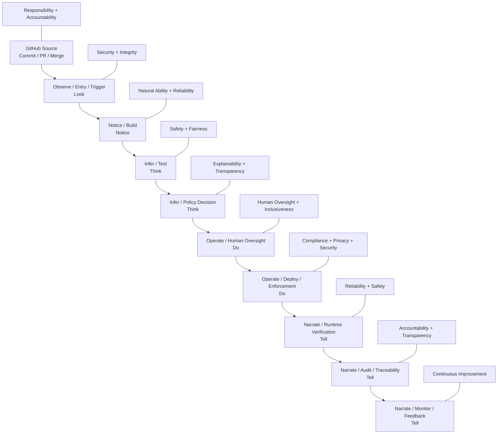
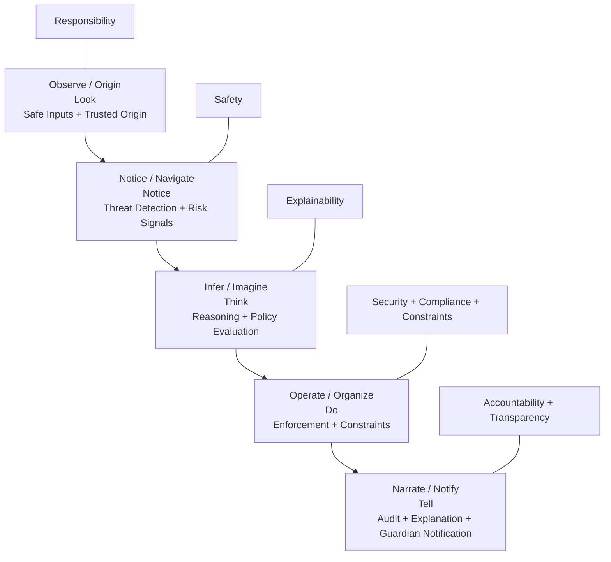

# 🧅 O.N.I.O.N — Observe, Notice, Infer, Operate, Narrate

[](https://docs.github.com/en/repositories/creating-and-managing-repositories/best-practices-for-repositories)
[](https://docs.github.com/en/repositories/creating-and-managing-repositories/best-practices-for-repositories)
[](https://learn.microsoft.com/en-us/azure/machine-learning/concept-responsible-ai?view=azureml-api-2)
[](https://learn.microsoft.com/en-us/azure/machine-learning/concept-responsible-ai?view=azureml-api-2)
[](https://cheatsheetseries.owasp.org/cheatsheets/CI_CD_Security_Cheat_Sheet.html)
[](https://cheatsheetseries.owasp.org/cheatsheets/CI_CD_Security_Cheat_Sheet.html)

Verified • Responsible • Safety-First AI System (Child-Centered)

O.N.I.O.N is a zero-trust, policy-driven AI architecture designed to help protect children through verification-first workflows, explainable decisions, parent-aware controls, and accountable systems.

---

## 🎯 Mission
Build systems that:
- ✅ Never act without verification
- ✅ Never decide without accountability
- ✅ Always explain their decisions
- ✅ Always prioritize safety (especially for children)

---

## 🧅 ONION Acronym (AI + Kid-Friendly)
| Letter | AI Meaning                       | Kid-Friendly |
|--------|----------------------------------|--------------|
| O      | Observe / Origin (input data)    | Look         |
| N      | Notice / Navigate (detect signals)| Notice       |
| I      | Infer / Imagine (decision making)| Think        |
| O      | Operate / Organize (policy exec) | Do           |
| N      | Narrate / Notify (explain+alert) | Tell         |

*Flow: Observe → Notice → Infer → Operate → Narrate*

---

## 🧠 Responsible AI Commitment
ONION enforces the 6 Responsible AI principles:
| Principle         | Meaning                              |
|-------------------|--------------------------------------|
| Fairness          | Avoid bias in decisions               |
| Reliability & Safety| Systems must behave safely           |
| Privacy & Security| Protect user data                    |
| Inclusiveness     | Accessible to all users              |
| Transparency      | Decisions must be explainable        |
| Accountability    | Humans remain responsible            |
These six principles are widely recognized as core Responsible AI standards. [1]

---

## 🏗 Core Architecture (5-Layer Defense)
Core Services:
| Service            | Role             |
|--------------------|------------------|
| api-gateway        | PEP (enforcement)|
| policy-pdp         | PDP (decision)   |
| approval-service   | Human approval   |
| telemetry-ingest   | Input validation |
| notification-service| Alerts          |
| audit-service      | Trace + compliance|

---

## 📦 onion-guardian-agent/ — Repository Structure & Trust Pipeline

```
onion-guardian-agent/
├── README.md
├── LICENSE
├── CODE_OF_CONDUCT.md
├── CONTRIBUTING.md
├── SECURITY.md
├── CHANGELOG.md
├── .gitignore
├── docker-compose.yml
├── .github/
│   ├── workflows/
│   ├── ISSUE_TEMPLATE/
│   └── PULL_REQUEST_TEMPLATE.md
├── services/
│   ├── api-gateway/
│   ├── policy-pdp/
│   ├── approval-service/
│   ├── telemetry-ingest/
│   ├── notification-service/
│   └── audit-service/
├── agents/
│   ├── behavior-agent/
│   ├── anomaly-agent/
│   ├── context-agent/
│   └── explanation-agent/
├── packages/
│   ├── shared-types/
│   ├── policy-sdk/
│   ├── logging-lib/
│   └── utils/
├── infrastructure/
│   ├── terraform/
│   ├── k8s/
│   └── scripts/
├── ci-cd/
│   ├── github-actions/
│   └── pipelines.md
├── configs/
│   ├── dev.env
│   ├── staging.env
│   ├── prod.env
│   └── policy-config.yaml
├── docs/
│   ├── 00-governance/
│   ├── 01-risk/
│   ├── 02-policy/
│   ├── 03-architecture/
│   ├── 04-security/
│   ├── 05-safety/
│   ├── 06-compliance/
│   ├── 07-verification/
│   ├── 08-audit/
│   └── 09-agents/
├── scripts/
├── tests/
└── resources/
```

---

## 🟪 Trust & Accountability Dev→Guardian Pipeline



---

### 🧠 Layered Security + Guardian Notification



---

##### 📈 End-to-End Flow (Blueprint)

[System Blueprint Diagram (Mermaid source in resources/diagrams)](https://github.com/MoneyMan421/O.N.I.O.N/blob/main/resources/diagrams/onion-system-blueprint.mmd)

---

#### Continuous loop: Commit → Verify → Decide → Approve → Deploy → Audit → Monitor → Improve

---

## ✅ Verification Layers (10-Level Zero-Trust)
| Layer          | What Is Verified        | How                                            |
|---------------|------------------------|------------------------------------------------|
| Source        | No secrets committed    | GitHub secret scanning, branch protection      |
| Dependencies  | No known CVEs           | Dependabot, dependency review, pip-audit       |
| Code          | Code quality & security | Static analysis, linting, test gates           |
| Secrets       | No credentials in code  | Secret scanning, push protection               |
| CI Pipeline   | Signed/controlled WF    | Workflow integrity checks                      |
| Artifacts     | Image integrity         | Signed artifacts, provenance verification      |
| Deployment    | Config matches policy   | Policy validation, env protections             |
| Runtime       | Requests are authorized | PEP → PDP enforcement                          |
| Audit         | Decisions are traceable | Immutable logs, reason codes                   |
| Alerts        | Guardians are notified  | Notification/escalation paths                  |

---

<small>Verified • Responsible • Safe • Secure • Explainable • Accountable • Compliant<br>
Mission enforced everywhere: Responsibility • Accountability • Explainability<br>
Natural Ability • Integrity • Safety • Compliance • Security • Constraints<br>
Responsible AI embedded everywhere: Fairness • Reliability & Safety • Privacy & Security • Inclusiveness • Transparency • Accountability</small>

---

<!-- The rest of the README remains unchanged. -->
