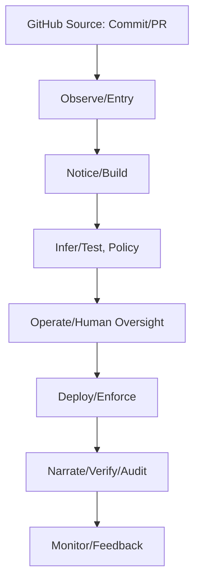

# 🧅 O.N.I.O.N — Observe, Notice, Infer, Operate, Narrate

**Verified • Responsible • Safety-First AI System (Child-Centered)**

[](https://docs.github.com/en/repositories/creating-and-managing-repositories/best-practices-for-repositories)
[](https://learn.microsoft.com/en-us/azure/machine-learning/concept-responsible-ai?view=azureml-api-2)
[](https://cheatsheetseries.owasp.org/cheatsheets/CI_CD_Security_Cheat_Sheet.html)

> O.N.I.O.N is a zero-trust, policy-driven AI architecture designed to help protect children through verification-first workflows, explainable decisions, parent-aware controls, and accountable systems.

---

## 🎯 Mission

- **Never act without verification**
- **Never decide without accountability**
- **Always explain all decisions**
- **Always prioritize safety (especially for children)**

---

## 📦 Quickstart

```bash
git clone https://github.com/MoneyMan421/O.N.I.O.N.git
cd O.N.I.O.N
cat README.md
```

---

## 🧅 ONION Acronym

| Letter | AI Meaning                     | Kid-Friendly |
|--------|--------------------------------|--------------|
| O      | Observe / Origin (input data)  | Look         |
| N      | Notice / Navigate (signals)    | Notice       |
| I      | Infer / Imagine (decide)       | Think        |
| O      | Operate / Organize (execute)   | Do           |
| N      | Narrate / Notify (explain)     | Tell         |

*Flow: Observe → Notice → Infer → Operate → Narrate*

---

## 🧠 Responsible AI Commitment

| Principle            | Meaning               |
|----------------------|----------------------|
| Fairness             | Avoid bias           |
| Reliability & Safety | Behave safely        |
| Privacy & Security   | Protect user data    |
| Inclusiveness        | Accessible to all    |
| Transparency         | Explainable choices  |
| Accountability       | Human oversight      |

See [Microsoft Responsible AI](https://www.microsoft.com/en-us/ai/responsible-ai)

---

## 🏗 Architecture: Layered Defense

```text
🧅 L1: INPUT    (Observe)
🧅 L2: SIGNAL   (Notice)
🧅 L3: DECISION (Infer → PDP)
🧅 L4: CONTROL  (Operate → PEP)
🧅 L5: OUTPUT   (Narrate/Audit)
```

**Core Services**:  
api-gateway (PEP enforcement), policy-pdp (PDP decision), approval-service (human approval), telemetry-ingest (input validation), notification-service (alerts), audit-service (trace & compliance)

---

## 📦 Repository Structure

<details>
<summary>Expand to view directory tree…</summary>

```text
onion-guardian-agent/
├── README.md
├── LICENSE
├── CODE_OF_CONDUCT.md
├── CONTRIBUTING.md
├── SECURITY.md
├── CHANGELOG.md
├── .github/
│   ├── workflows/...
├── services/...
├── agents/...
├── packages/...
├── infrastructure/...
├── ci-cd/...
├── configs/...
├── docs/...
├── scripts/
├── tests/
└── resources/diagrams/
```
</details>

---

## 🟪 From Dev to Guardian (Overview)



---

## ✅ Security & Compliance Checklist

- [ ] Branch protection and code review required
- [ ] Dependabot and secret scanning enabled
- [ ] Code scanning (CodeQL) active
- [ ] No secrets in code
- [ ] OIDC for GitHub Actions
- [ ] Minimal permissions for CI workflows
- [ ] Container/image signing and provenance
- [ ] Audit trail for all sensitive actions

See [OWASP CI/CD Security](https://cheatsheetseries.owasp.org/cheatsheets/CI_CD_Security_Cheat_Sheet.html)  
Supports GDPR, COPPA, ISO 27001, NIST AI RMF, OWASP ASVS L2.

---

## 🤝 Contributing

All contributors must follow our [Code of Conduct](CODE_OF_CONDUCT.md).  
See [CONTRIBUTING.md](CONTRIBUTING.md) for guidelines.

---

## 📜 License

See [LICENSE](LICENSE) for details.

---

## References

- [GitHub Best Practices](https://docs.github.com/en/repositories/creating-and-managing-repositories/best-practices-for-repositories)
- [Microsoft Responsible AI Principles](https://www.microsoft.com/en-us/ai/responsible-ai)
- [OWASP CI/CD Security Cheat Sheet](https://cheatsheetseries.owasp.org/cheatsheets/CI_CD_Security_Cheat_Sheet.html)
