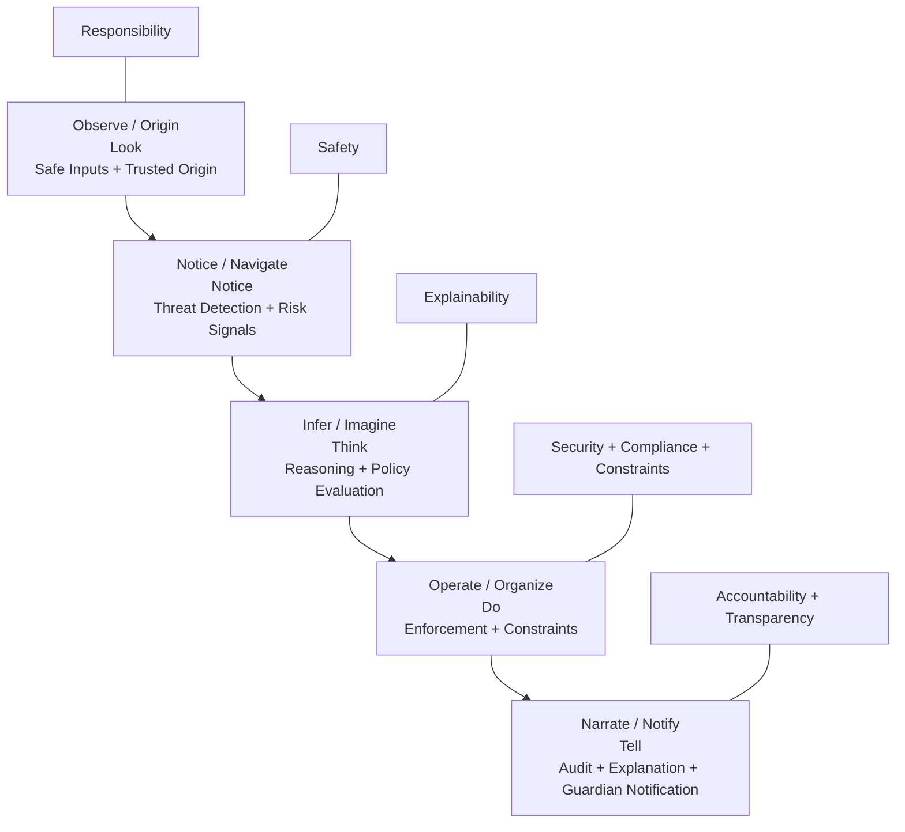
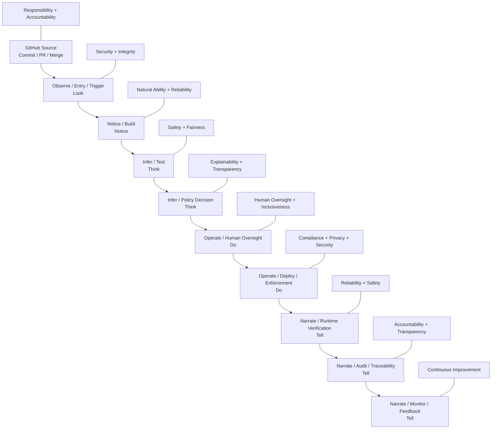

# 🧅 O.N.I.O.N (Observe, Notice, Infer, Operate, Narrate)
**Verified, Responsible, Safety-First AI System for Child Protection**

[](https://docs.github.com/en/repositories/creating-and-managing-repositories/best-practices-for-repositories)
[](https://learn.microsoft.com/en-us/azure/machine-learning/concept-responsible-ai?view=azureml-api-2)
[](https://cheatsheetseries.owasp.org/cheatsheets/CI_CD_Security_Cheat_Sheet.html)

> O.N.I.O.N is a zero-trust, policy-driven AI architecture designed to help protect children through verification-first workflows, explainable decisions, parent-aware controls, and accountable system design.

---

## 🎯 Mission + Responsible AI Commitment

O.N.I.O.N exists to build systems that **never operate without verification** and **never make decisions without responsibility**.

Our mission and our Responsible AI commitment are one framework. We do not separate technical execution from ethical responsibility. We design systems that are safe, secure, explainable, accountable, and guided by human oversight at every layer. In O.N.I.O.N, trust is never assumed — it is earned through validation, transparency, and evidence.

### Core Mission Standards

- **Responsibility** — Every action, recommendation, and system behavior must be designed with care because real children, families, and communities may be affected.
- **Accountability** — We do not guess when certainty matters. If information is incomplete, uncertain, or unclear, the system must ask for clarification, defer safely, or deny by default.
- **Explainability** — Decisions must be understandable, traceable, and supported by clear reason codes, evidence, and logic.
- **Natural Ability** — Tools and capabilities are used only where they naturally fit the task and add justified value.
- **Integrity** — Systems must act honestly, consistently, and within declared boundaries.
- **Safety** — Harm reduction, child protection, and secure defaults are non-negotiable.
- **Compliance** — Governance, standards, policies, and legal obligations must be respected by design.
- **Security** — Identities, systems, artifacts, and data paths must be protected with defense-in-depth safeguards.
- **Constraints** — Trustworthy AI must remain within explicit permissions, intended use, and enforced operational limits.

### Responsible AI Principles Embedded in the Mission

| Principle | Expression in O.N.I.O.N |
|---|---|
| ⚖️ **Fairness** | Decisions are policy-driven, reviewable, and designed to reduce arbitrary or biased outcomes |
| 🛡️ **Reliability & Safety** | Systems are tested, monitored, and denied by default when uncertainty creates risk |
| 🔒 **Privacy & Security** | Child data is minimized, protected, encrypted, and governed carefully |
| 🌍 **Inclusiveness** | Safeguards and explanations are designed for real families, guardians, and oversight roles |
| 🔍 **Transparency** | Decisions require reason codes, traceability, and understandable explanations |
| ✅ **Accountability** | Human responsibility remains attached to high-impact actions and outcomes |

**Core principle:**  
> Verified systems + Responsible AI at every layer = trustworthy execution.

---

## 🧅 What O.N.I.O.N Means

The acronym describes how the system works in a way that is understandable to both technical teams and children.

| Letter | AI Meaning | Kid-Friendly Meaning | What It Does |
|---|---|---|---|
| **O** | Observe / Origin | 👀 Look | Collect safe inputs and check where they came from |
| **N** | Notice / Navigate | 🔎 Notice | Detect patterns, changes, and possible risk signals |
| **I** | Infer / Imagine | 🤔 Think | Reason carefully about what is happening and what is safest |
| **O** | Operate / Organize | ✅ Do | Apply rules, enforce constraints, and act safely |
| **N** | Narrate / Notify | 📢 Tell | Explain the decision and tell the right people |

**Kid version:** **Look → Notice → Think → Do → Tell**

---

## 🧠 Core Architecture

O.N.I.O.N uses a layered, defense-in-depth architecture so that no single action, service, or control is trusted by itself.

### Layered Model



### Core Services

| Service | Role | Description |
|---|---|---|
| `api-gateway` | Policy Enforcement Point (PEP) | Entry point that validates and enforces every request |
| `policy-pdp` | Policy Decision Point (PDP) | Evaluates policy rules and returns decisions with reasons |
| `approval-service` | Guardian / Human Oversight | Handles parent approvals, escalations, and overrides |
| `telemetry-ingest` | Signal Intake | Validates and ingests telemetry from devices and services |
| `notification-service` | Alerts & Communication | Notifies guardians, operators, and stakeholders |
| `audit-service` | Immutable Evidence | Stores tamper-resistant records for decisions and events |

### Operating Model

- **Agents propose** signals, context, or recommendations
- **PDP decides** using policy as the source of truth
- **PEP enforces** approved constraints and runtime boundaries
- **Audit proves** what happened and why
- **Verification validates** every critical layer continuously

In simple terms: **agents can suggest, policy decides, systems enforce, and audit explains**.

---

## 🔁 Full System Flow

The full operating flow below shows how mission standards and Responsible AI principles are embedded into the end-to-end lifecycle.

```text
────────────────────────────────────────────────────────────────────────
Verified • Responsible • Safe • Secure • Explainable • Accountable • Compliant
Mission enforced everywhere: Responsibility • Accountability • Explainability
Natural Ability • Integrity • Safety • Compliance • Security • Constraints
Responsible AI embedded everywhere: Fairness • Reliability & Safety • Privacy & Security
Inclusiveness • Transparency • Accountability
────────────────────────────────────────────────────────────────────────
👤 Developer
   │
   ▼
┌───────────────────────────────────────────────────────────┐
│ GitHub Source (Commit / PR / Merge)                      │
└───────────────────────────────────────────────────────────┘
   │ ✅ VERIFY: code integrity + review trail
   │ 🧠 MISSION: accountability, integrity, constraints
   │ 🧠 RAI: transparency, accountability
   ▼
🧅 L1 — OBSERVE / ENTRY / TRIGGER
┌───────────────────────────────────────────────────────────┐
│ GitHub Actions Trigger                                   │
│ - workflow events (push / PR)                            │
│ - protected branches                                     │
└───────────────────────────────────────────────────────────┘
   │ ✅ VERIFY: trigger correctness + permissions
   │ 🧠 MISSION: responsibility, security
   │ 🧠 RAI: transparency, accountability
   ▼
🧅 L2 — NOTICE / BUILD
┌───────────────────────────────────────────────────────────┐
│ Build & Package                                          │
│ - install dependencies                                   │
│ - create trusted artifact                                │
└───────────────────────────────────────────────────────────┘
   │ ✅ VERIFY: reproducible artifact
   │ ✅ INTEGRITY: trusted build outputs
   │ 🧠 MISSION: integrity, natural ability, constraints
   │ 🧠 RAI: reliability & safety
   ▼
🧅 L3 — INFER / TEST
┌───────────────────────────────────────────────────────────┐
│ Test & Quality Gates                                     │
│ - unit / integration tests                               │
│ - lint / static checks                                   │
└───────────────────────────────────────────────────────────┘
   │ ✅ VERIFY: correctness + quality
   │ 🛡️ SAFETY: prevent unsafe regressions
   │ 🧠 MISSION: safety, responsibility, explainability
   │ 🧠 RAI: reliability & safety, fairness
   ▼
🧅 L4 — INFER / POLICY DECISION
┌───────────────────────────────────────────────────────────┐
│ Policy Decision Point (PDP)                              │
│ - security checks + compliance rules                     │
│ - returns decision + reasons + obligations               │
└───────────────────────────────────────────────────────────┘
   │ ✅ VERIFY: compliance + security gates
   │ ✅ EXPLAINABILITY: reason codes required
   │ 🧠 MISSION: accountability, explainability, compliance, constraints
   │ 🧠 RAI: fairness, transparency, accountability
   ▼
🧅 L5 — OPERATE / HUMAN OVERSIGHT
┌───────────────────────────────────────────────────────────┐
│ Approval Gate                                            │
│ - parent approval for sensitive actions                  │
│ - release approval for high-risk production changes      │
└───────────────────────────────────────────────────────────┘
   │ ✅ VERIFY: authorized oversight
   │ 🧠 MISSION: responsibility, accountability, safety
   │ 🧠 RAI: accountability, inclusiveness
   ▼
🧅 L6 — OPERATE / DEPLOY / ENFORCEMENT
┌───────────────────────────────────────────────────────────┐
│ Deploy to Azure / Runtime Enforcement                    │
│ - deploy revision                                        │
│ - enforce ingress and runtime policies                   │
└───────────────────────────────────────────────────────────┘
   │ ✅ VERIFY: correct environment + constraints
   │ 🔐 SECURITY: no bypass allowed
   │ 🧠 MISSION: security, compliance, integrity, constraints
   │ 🧠 RAI: privacy & security
   ▼
🧅 L7 — NARRATE / RUNTIME VERIFICATION
┌───────────────────────────────────────────────────────────┐
│ Runtime Checks                                           │
│ - health / readiness / liveness                          │
│ - smoke tests                                            │
└───────────────────────────────────────────────────────────┘
   │ ✅ VERIFY: safe operation + stability
   │ 🧠 MISSION: safety, responsibility
   │ 🧠 RAI: reliability & safety
   ▼
🧅 L8 — NARRATE / AUDIT / TRACEABILITY
┌───────────────────────────────────────────────────────────┐
│ Audit Evidence                                           │
│ - decision logs + correlation IDs                        │
│ - policy versions + reason codes                         │
└───────────────────────────────────────────────────────────┘
   │ ✅ VERIFY: accountability evidence
   │ 🧠 MISSION: explainability, accountability, integrity
   │ 🧠 RAI: transparency, accountability
   ▼
🧅 L9 — NARRATE / MONITOR / FEEDBACK LOOP
┌───────────────────────────────────────────────────────────┐
│ Monitoring / Observability                               │
│ - logs / metrics / alerts                                │
│ - anomaly detection                                      │
└───────────────────────────────────────────────────────────┘
   │ ✅ VERIFY: drift detection + continuous evaluation
   │ 🧠 MISSION: responsibility, safety, natural ability
   │ 🧠 RAI: reliability & safety, transparency
   ▼
🔁 Continuous loop: Commit → Verify → Decide → Approve → Deploy → Audit → Monitor → Improve
```

### Mermaid Flow View



---

## ✅ Verification at Every Layer

| Layer | What Is Verified | How |
|---|---|---|
| **Source Code** | No secrets committed | GitHub secret scanning, branch protection, and review controls |
| **Dependencies** | No known CVEs | Dependabot, dependency review, and package auditing |
| **Build** | Code quality and security | Static analysis, linting, and test gates |
| **Artifact** | Image integrity | Signed artifacts and provenance verification |
| **Registry** | Image not tampered | Trusted registry controls and validation |
| **Deployment** | Config matches policy | Policy validation and environment protections |
| **Runtime** | Requests are authorized | PEP → PDP policy enforcement |
| **Data** | Inputs are safe | Input validation, schema checks, and minimization |
| **Decisions** | Decisions are explainable | Reason codes, audit logs, and trace evidence |
| Alerts | Guardians are notified | Notification rules and escalation paths |

---

## 🛡 Child Safety Guidelines

### Safety Defaults
- Default deny when uncertainty creates risk
- Parent authority for sensitive actions
- Explainability required for all meaningful decisions
- No child-impacting high-risk action without verification and approval

### Prohibited Behavior
- No autonomous high-risk action without PDP and approval
- No silent decisions or hidden enforcement actions
- No fabricated explanations
- No leakage of sensitive child data

### Guardrails
- Agents may propose, but never enforce
- PDP is the only source of final allow / deny decisions
- PEP must enforce policy results without bypass
- Audit records must preserve decision evidence and traceability

---

## 🛑 Safety Invariants (NON NEGOTIABLE)

- No action without PDP = ALLOW
- No autonomous high-risk decisions
- Default = DENY when uncertain
- Human approval required for sensitive actions
- All decisions must include reason codes

---

## 🔒 Compliance, Safety & Security Guidelines

### Security Principles
- **No long-lived credentials** — prefer OIDC and workload identity
- **Least privilege** — each identity gets only required permissions
- **Immutable artifacts** — build once, sign once, deploy verified outputs
- **Dependency discipline** — lock dependencies and monitor drift
- **Audit everything** — record builds, releases, decisions, and runtime changes

### GitHub Actions Workflow Security

Workflows must follow least-privilege principles. Use per-scope permissions — not a single blanket `read` value. For example:

```yaml
permissions:
  contents: read
  id-token: write
```

Additional workflow hardening requirements:
- Pin third-party actions to a specific commit SHA
- Use OIDC (`id-token: write`) instead of long-lived static secrets
- Run dependency vulnerability scanning (e.g., `pip-audit`, `npm audit`) as a required CI gate
- Restrict `permissions` to only scopes required by the job

### Safety Rules
- **No autonomous action without policy approval** — `policy-pdp` must return `ALLOW`
- **No silent failures** — significant failures must surface to `notification-service`
- **Guardian override always available** — `approval-service` enables human review
- **Data minimization** — collect only necessary child data and retain it carefully

### Privacy
- Telemetry must be minimized and protected before storage
- Sensitive data must be encrypted in transit and at rest
- All sensitive data should be protected in transit and storage
- Retention policies and access controls must be enforced

### Regulatory Alignment
- GDPR / COPPA — child data protection by design
- ISO 27001 — information security controls
- NIST AI RMF — AI risk management alignment
- OWASP ASVS — application security verification guidance

---

## 📦 Repository Structure

This repository is organized as a production-grade monorepo separating services, agents, packages, infrastructure, configuration, documentation, scripts, tests, and resources.

```text
onion-guardian-agent/
│
├── README.md                        # Full system doc (this file)
├── LICENSE
├── CODE_OF_CONDUCT.md
├── CONTRIBUTING.md
├── SECURITY.md
├── CHANGELOG.md
│
├── .gitignore
├── docker-compose.yml
│
├── .github/
│   ├── workflows/
│   │   ├── ci.yml                   # Build + test pipeline
│   │   ├── security.yml             # Security scans / SAST / SCA
│   │   ├── deploy.yml               # Deploy to Azure / cloud
│   │   └── policy-check.yml         # PDP validation before deploy
│   │
│   ├── ISSUE_TEMPLATE/
│   │   ├── bug_report.md
│   │   └── feature_request.md
│   │
│   └── PULL_REQUEST_TEMPLATE.md
│
├── services/                        # 🧅 Core Microservices
│   ├── api-gateway/                 # PEP (policy enforcement point)
│   │   ├── Dockerfile
│   │   ├── package.json
│   │   └── src/
│   │
│   ├── policy-pdp/                  # PDP (decision engine)
│   │   ├── Dockerfile
│   │   └── src/
│   │
│   ├── approval-service/            # Parent approval / human oversight
│   │   └── src/
│   │
│   ├── telemetry-ingest/            # Intake and validation of signals
│   │   └── src/
│   │
│   ├── notification-service/        # Alerts (parent / child / staff)
│   │   └── src/
│   │
│   └── audit-service/               # Immutable logs / trace / evidence
│       └── src/
│
├── agents/                          # 🤖 Agent Layer (non-authoritative)
│   ├── behavior-agent/              # Detects risk patterns
│   ├── anomaly-agent/               # Anomaly / safety detection
│   ├── context-agent/               # Enriches signals with context
│   └── explanation-agent/           # Builds explanations only
│
├── packages/                        # Shared libraries and utilities
│   ├── shared-types/
│   ├── policy-sdk/
│   ├── logging-lib/
│   └── utils/
│
├── infrastructure/                  # ☁️ Infrastructure as Code
│   ├── terraform/
│   │   ├── modules/
│   │   └── environments/
│   │       ├── dev/
│   │       ├── staging/
│   │       └── prod/
│   │
│   ├── k8s/                         # Kubernetes / Azure manifests
│   │   ├── api-gateway.yaml
│   │   ├── policy-pdp.yaml
│   │   └── audit.yaml
│   │
│   └── scripts/
│       ├── deploy.sh
│       └── rollback.sh
│
├── ci-cd/
│   ├── github-actions/
│   │   ├── build.yml
│   │   ├── test.yml
│   │   └── deploy.yml
│   └── pipelines.md
│
├── configs/                         # ⚙️ Configuration
│   ├── dev.env
│   ├── staging.env
│   ├── prod.env
│   └── policy-config.yaml
│
├── docs/                            # 📚 Compliance, Safety & Architecture
│   ├── 00-governance/
│   │   ├── mission.md
│   │   ├── responsible-ai.md
│   │   └── roles.md
│   │
│   ├── 01-risk/
│   │   ├── threat-model.md
│   │   └── risk-register.md
│   │
│   ├── 02-policy/
│   │   ├── pdp-contract.md
│   │   ├── reason-codes.md
│   │   └── obligations.md
│   │
│   ├── 03-architecture/
│   │   ├── diagrams.md
│   │   └── onion-model.md
│   │
│   ├── 04-security/
│   │   ├── auth.md
│   │   ├── secrets.md
│   │   └── ci-cd-security.md
│   │
│   ├── 05-safety/
│   │   ├── child-safety.md
│   │   ├── guardrails.md
│   │   └── approval-flows.md
│   │
│   ├── 06-compliance/
│   │   ├── checklist.md
│   │   ├── audit-requirements.md
│   │   └── standards-mapping.md
│   │
│   ├── 07-verification/
│   │   ├── test-strategy.md
│   │   └── runtime-validation.md
│   │
│   ├── 08-audit/
│   │   ├── audit-schema.md
│   │   └── evidence.md
│   │
│   └── 09-agents/
│       ├── agent-contract.md
│       └── safety-rules.md
│
├── scripts/                         # Automation and dev tools
│   ├── build.sh
│   ├── test.sh
│   ├── lint.sh
│   └── local-dev.sh
│
├── tests/                           # ✅ Verification
│   ├── unit/
│   ├── integration/
│   ├── security/
│   └── e2e/
│
└── resources/                       # Images, diagrams, assets
    ├── diagrams/
    └── images/
```

---

## 📚 Documentation Structure

Use the following conventions for deeper reference documentation:

- `README.md` — primary public-facing overview
- `docs/00-governance/` — mission, roles, and responsible AI governance
- `docs/03-architecture/` — diagrams, layered model, and runtime design
- `docs/05-safety/` — child-safety guardrails and approval flows
- `docs/06-compliance/` — audit checklists, standards mapping, and evidence requirements
- `docs/09-agents/` — agent contracts and safety rules
- `resources/diagrams/` — Mermaid sources and visual assets

This keeps the main README readable for visitors while preserving deeper reference material in stable supporting files.

---

## 🚀 Getting Started

```bash
# Clone the repository
git clone https://github.com/Big-Orga/O.N.I.O.N.git
cd O.N.I.O.N

# Review the main system overview
cat README.md
```

---

## 🤝 Contributing

Please read [CONTRIBUTING.md](CONTRIBUTING.md) before submitting pull requests.  
All contributors must follow the [Code of Conduct](CODE_OF_CONDUCT.md).  
To report security issues, see [SECURITY.md](SECURITY.md).

---

## 📜 License

See [LICENSE](LICENSE) for details.

---

## 🔗 References

- [GitHub Best Practices for Repositories](https://docs.github.com/en/repositories/creating-and-managing-repositories/best-practices-for-repositories)
- [Microsoft Responsible AI Principles](https://learn.microsoft.com/en-us/azure/machine-learning/concept-responsible-ai?view=azureml-api-2)
- [Azure Security and Responsible AI Guide](https://azure.github.io/Security-and-Responsible-AI-Guide/chapters/chapter_01_understanding_security_and_responsible_ai)
- [OWASP CI/CD Security Cheat Sheet](https://cheatsheetseries.owasp.org/cheatsheets/CI_CD_Security_Cheat_Sheet.html)
- [NIST AI Risk Management Framework](https://www.nist.gov/system/files/documents/2023/01/26/AI%20RMF%201.0.pdf)
- [SLSA Supply Chain Levels for Software Artifacts](https://slsa.dev/)
